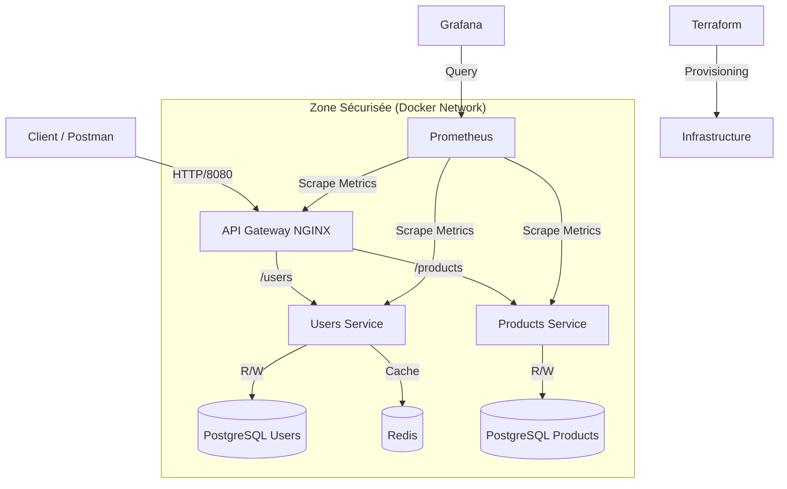

# RAPPORT FINAL DU MINI-PROJET
## Architecture Microservices Cloud-Native

**Auteur :** Fares
**Date :** 5 Décembre 2025
**Sujet :** Développement, Déploiement et Orchestration d'une Architecture Microservices

---

## 📑 TABLE DES MATIÈRES

1. [Introduction & Architecture Globale](#1-introduction--architecture-globale)
2. [Microservices Développés](#2-microservices-développés)
3. [Base de Données : Modélisation & Normalisation](#3-base-de-données--modélisation--normalisation)
4. [Infrastructure & Orchestration (Docker & Terraform)](#4-infrastructure--orchestration)
5. [API Gateway & Routing](#5-api-gateway--routing)
6. [Observabilité & Monitoring](#6-observabilité--monitoring)
7. [Sécurité Avancée](#7-sécurité-avancée)
8. [Optimisation & Performance SQL](#8-optimisation--performance-sql)
9. [Tests & Validation](#9-tests--validation)
10. [Conclusion](#10-conclusion)

---

## 1. INTRODUCTION & ARCHITECTURE GLOBALE

Ce projet consiste en la conception et le déploiement 2. MICROSERVICES DÉVELOPPÉS
Deux microservices distincts ont été développés avec Node.js et Express, suivant les principes RESTful.

A. Users Service (users-service)
Service responsable de la gestion des utilisateurs et de leurs commandes.

Stack : Node.js, Express, pg (PostgreSQL), Redis (Cache).
Fonctionnalités Clés :
CRUD Utilisateurs complet.
Gestion des Commandes (Orders) et Lignes de commande.
Système de Caching Redis pour les lectures fréquentes.
Métriques Prometheus exposées sur /metrics.
B. Products Service (products-service)
Service dédié au catalogue produit et à la catégorisation.

Stack : Node.js, Express, pg.
Fonctionnalités Clés :
CRUD Produits avec gestion de stock.
Gestion des Catégories hiérarchiques (Arborescence).
Recherche et filtrage avancés.
'une architecture microservices robuste, sécurisée et observable pour une application e-commerce. L'objectif était de maîtriser l'ensemble du cycle de vie DevOps, du développement (Node.js) à l'infrastructure as code (Terraform), en passant par la conteneurisation (Docker) et le monitoring (Grafana).

### Schéma de l'Architecture Finale

---

## 2. MICROSERVICES DÉVELOPPÉS

Deux microservices distincts ont été développés avec **Node.js** et **Express**, suivant les principes RESTful.

### A. Users Service (`users-service`)
Service responsable de la gestion des utilisateurs et de leurs commandes.
- **Stack** : Node.js, Express, pg (PostgreSQL), Redis (Cache).
- **Fonctionnalités Clés** :
  - CRUD Utilisateurs complet.
  - Gestion des Commandes (Orders) et Lignes de commande.
  - Système de Caching Redis pour les lectures fréquentes.
  - Métriques Prometheus exposées sur `/metrics`.

### B. Products Service (`products-service`)
Service dédié au catalogue produit et à la catégorisation.
- **Stack** : Node.js, Express, pg.
- **Fonctionnalités Clés** :
  - CRUD Produits avec gestion de stock.
  - Gestion des Catégories hiérarchiques (Arborescence).
  - Recherche et filtrage avancés.

---

## 3. BASE DE DONNÉES : MODÉLISATION & NORMALISATION

Une attention particulière a été portée à la structure des données, aboutissant à un modèle normalisé en **3ème Forme Normale (3NF)**.

### Modèle Conceptuel de Données (MCD)

Le modèle final comprend 8 tables réparties sur deux bases de données pour respecter l'isolation des services.

**Users DB :**
- `ROLES` (1,n) --- (1,1) `USERS`
- `USERS` (1,n) --- (1,1) `ORDERS`
- `ORDERS` (1,n) --- (1,1) `ORDER_ITEMS`

**Products DB :**
- `CATEGORIES` (1,n) --- (1,1) `PRODUCTS`
- `CATEGORIES` (0,n) --- (0,1) `CATEGORIES` (Auto-référence pour hiérarchie)

### Normalisation 3NF
- **1NF** : Toutes les valeurs sont atomiques (pas de listes dans une colonne).
- **2NF** : Toutes les colonnes non-clés dépendent de la clé primaire entière (ex: prix unitaire stocké dans `order_items` pour l'historique).
- **3NF** : Pas de dépendances transitives (ex: le rôle est séparé dans une table `roles`, pas juste une colonne string dans `users`).

**Livrables associés :**
- `MCD-MLD.md` : Diagrammes complets.
- `migration-module7.sql` : Scripts de création et migration.

---

## 4. INFRASTRUCTURE & ORCHESTRATION

L'infrastructure a été gérée selon deux approches complémentaires.

### A. Docker Compose (Développement)
Le fichier `docker-compose.yml` orchestre l'ensemble de la stack pour le développement local.
- **Services** : users-service, products-service, postgres (x2), redis, nginx, prometheus, grafana.
- **Volumes** : Persistance des données DB et logs.
- **Réseau** : Bridge network dédié pour l'isolation.

### B. Terraform (Infrastructure as Code)
Le Module 9 a migré le déploiement vers Terraform pour une approche "Production-Ready".
- **Provider** : `kreuzwerker/docker`.
- **Ressources** : Définition déclarative du réseau, des volumes, et des conteneurs.
- **Modularité** : Utilisation de variables (`variables.tf`) pour la configuration.
- **Sécurité** : Gestion des secrets via variables sensibles.

**Livrables associés :**
- `docker-compose.yml`
- Dossier `terraform/` (`main.tf`, `variables.tf`, `outputs.tf`)

---

## 5. API GATEWAY & ROUTING

Un serveur **NGINX** agit comme point d'entrée unique (Reverse Proxy) pour l'application.

### Configuration (`nginx/gateway.conf`)
- **Routing** :
  - `/users` -> Redirigé vers `users-service:3000`
  - `/products` -> Redirigé vers `products-service:3001`
- **Load Balancing** : Configuration prête pour distribuer la charge entre plusieurs instances.
- **Headers de Sécurité** : Ajout automatique de headers (CORS, X-ID).
- **Gestion d'erreurs** : Pages d'erreurs personnalisées et logs centralisés.

---

## 6. OBSERVABILITÉ & MONITORING

Une stack complète de monitoring a été mise en place pour surveiller la santé du système.

### Prometheus
- Collecte les métriques techniques (CPU, RAM) et métier (Requêtes/sec, Latence) via scraping toutes les 5s.
- Configuration dans `prometheus.yml`.

### Grafana
- **Dashboard Personnalisé** : Visualisation en temps réel.
- **Panneaux** :
  - Débit (RPS) par service.
  - Latence (p95, p99).
  - Taux d'erreur (Codes 4xx/5xx).
  - Saturation (Utilisation CPU/Mémoire des conteneurs).
  - Métriques métier (Nombre de commandes, Produits en stock).

**Livrables associés :**
- `grafana/dashboards/users-service-dashboard.json`

---

## 7. SÉCURITÉ AVANCÉE

Le Module 6 a renforcé la sécurité de l'API selon les principes de "Defense in Depth".

### Mesures Implémentées
1. **Gestion des Secrets** : Utilisation stricte de variables d'environnement (`.env`) pour les identifiants DB et clés API.
2. **Moindre Privilège** : Création d'utilisateurs PostgreSQL limités (CRUD uniquement, pas de DROP/ALTER).
3. **Validation des Entrées** : Middleware `express-validator` pour assainir toutes les entrées (XSS, SQL Injection).
4. **Rate Limiting** : Protection contre les attaques Brute-force et DoS.
5. **Headers HTTP** : Utilisation de `helmet` pour sécuriser les en-têtes HTTP.
6. **CORS Restrictif** : Liste blanche des origines autorisées.
7. **Logging de Sécurité** : Middleware personnalisé pour détecter les tentatives d'intrusion.

---

## 8. OPTIMISATION & PERFORMANCE SQL

Le Module 8 a transformé les performances de la base de données.

### Optimisations Réalisées
1. **Indexation Stratégique** : Ajout de 16 index (B-Tree, GIN, Composite) sur les colonnes fréquemment recherchées (`email`, `category_id`, `created_at`).
2. **Réécriture de Requêtes** :
   - Remplacement de `SELECT *` par des projections ciblées.
   - Utilisation de `JOIN` explicites.
   - Pagination via `LIMIT/OFFSET`.
3. **Analyse EXPLAIN ANALYZE** :
   - Gain de performance mesuré : **x7** sur les requêtes de dashboard (2.2ms vs 15.8ms).
   - Suppression des "Sequential Scans" au profit des "Index Scans".

**Livrables associés :**
- `optimization-module8.sql`

---

## 9. TESTS & VALIDATION

La qualité du code a été assurée par des tests rigoureux.

### Tests Postman
Une collection complète (`Products-Service.postman_collection.json`) couvre :
- Scénarios nominaux (Création, Lecture, Mise à jour, Suppression).
- Scénarios d'erreur (Validation, 404, Conflits).
- Tests de performance API (Temps de réponse).

### Scripts de Test
Des scripts PowerShell (`test-endpoints.ps1`, `generate-traffic.ps1`) ont été créés pour automatiser la validation et générer du trafic pour le monitoring.

---

## 10. CONCLUSION

Ce mini-projet a permis de construire une plateforme **complète, moderne et industrielle**.

**Points Forts de la Solution :**
- ✅ **Architecture découplée** : Services indépendants et scalables.
- ✅ **Infrastructure as Code** : Déploiement reproductible via Terraform.
- ✅ **Haute Performance** : Base de données optimisée et caching Redis.
- ✅ **Sécurité by Design** : Protection multicouche intégrée.
- **Observabilité Totale** : Visibilité complète sur l'état du système.

L'architecture finale est prête pour un déploiement en production, respectant les standards actuels du développement Cloud-Native.
